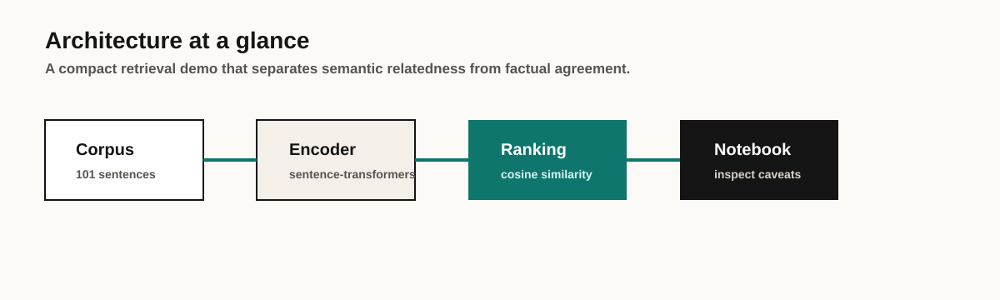

# Sentence Similarity Analysis

<div align="center">


[](https://github.com/MatthewPaver/sentence-similarity-analysis/actions/workflows/validate.yml)

**Semantic similarity demo using sentence-transformer embeddings**

*Notebook-first project exploring how modern embedding models rank related sentences*

</div>

---

## Portfolio Quick Read

| Section | Where to look |
|:---|:---|
| What it solves | Shows what sentence embeddings are useful for, and where similarity can mislead |
| Quick start | `make notebook` or [Quick Start](#quick-start) |
| Screenshot | [Portfolio Store](https://matthewpaver.github.io/MatthewPaver/store/) |
| Architecture | [What It Covers](#what-it-covers) |
| Tests | `make check-data`, then run `response.ipynb` and compare [Expected Result](#expected-result) |
| Tech stack | `Python` `Jupyter` `sentence-transformers` `PyTorch` |

## Overview

This repo is a compact NLP experiment rather than a packaged application. It uses transformer-based sentence embeddings and cosine similarity to rank a corpus of 101 factual statements against a target sentence about polar bear fur.

The point of the project is not just to produce a ranking, but to show what embedding-based similarity does well and where it can mislead. In particular, semantically similar text is not the same thing as factually correct text.

## Reviewer Pack

| Area | Details |
|:---|:---|
| What it solves | Demonstrates where embedding similarity helps retrieval and where it can confuse relatedness with truth. |
| Screenshot | [Portfolio Store preview](https://matthewpaver.github.io/MatthewPaver/store/preview.html?app=sentence) |
| Run locally | `make notebook` opens the notebook with the expected kernel installed. |
| Tests | `make check-data`; notebook output should match the [Expected Result](#expected-result) shape. |
| Demo data | Included in `data.txt` with 101 candidate sentences. |
| Architecture | Text corpus -> sentence-transformer embeddings -> cosine ranking -> notebook interpretation |
| Limitations | Focused concept demo; not a packaged retrieval API or fact-checking system. |

## Reviewer Notes

- **Reproducible path:** create the environment, open `response.ipynb`, and run all cells from the repository root.
- **AI signal:** the repo shows embedding retrieval behaviour in a way that is easy to inspect and challenge.
- **Quality signal:** the README calls out the key limitation: similarity is not factual agreement.
- **Known limit:** this is a focused notebook demo, not a packaged retrieval API.

## What It Covers



- sentence embeddings with `sentence-transformers`
- cosine similarity for ranking related text
- notebook-based inspection of the top matches
- discussion of semantic similarity versus factual accuracy

## Expected Result

Target sentence:

```text
A polar bear's fur is actually transparent, and not white (as is commonly believed).
```

Representative top matches from the notebook:

| Rank | Sentence | Score |
|:---:|:---|---:|
| 1 | The fur of a polar bear is transparent, not white. | 0.9337 |
| 2 | Polar bears are renowned for their white fur. | 0.7957 |
| 3 | A polar bear's skin is black underneath its fur. | 0.6820 |

This is the core lesson of the demo: embedding similarity is good at finding related text, but it does not guarantee factual agreement.

## Quick Start

### Option 1: `venv`

```bash
python3 -m venv .venv
source .venv/bin/activate
pip install --upgrade pip
pip install -r requirements.txt
python -m ipykernel install --user --name=embeds --display-name="embeds"
jupyter lab
```

Open `response.ipynb`, select the `embeds` kernel, and run the notebook from the repository root.

### Option 2: Conda

```bash
conda env create -f environment.yml
conda activate embeds
python -m ipykernel install --user --name=embeds --display-name="embeds"
jupyter lab
```

## Repository Contents

```text
response.ipynb     Main notebook with the analysis
data.txt           Corpus of 101 candidate sentences
requirements.txt   Pip dependencies
environment.yml    Conda environment
```

## Notes

- Status: completed notebook demo
- Hardware: CPU is sufficient
- Main model: `sentence-transformers/all-mpnet-base-v2`
- Main takeaway: embedding similarity is useful for retrieval and clustering, but not reliable by itself for fact-checking

## Related Work

- [MatthewPaver profile](https://github.com/MatthewPaver)
- [Project Index](https://github.com/MatthewPaver/MatthewPaver/blob/main/Projects.md)
